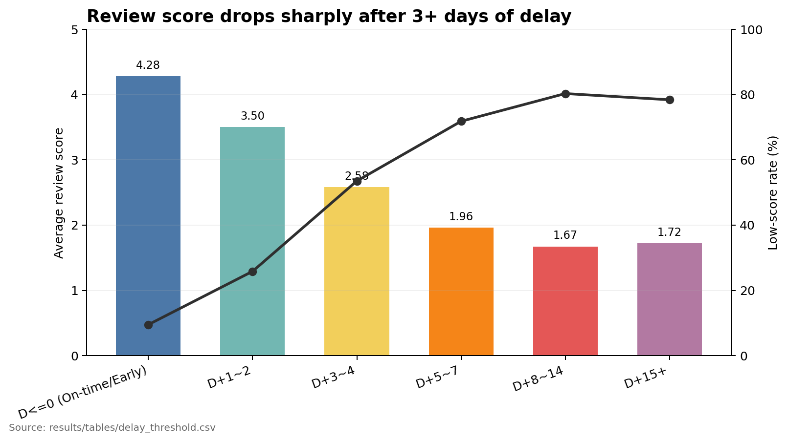
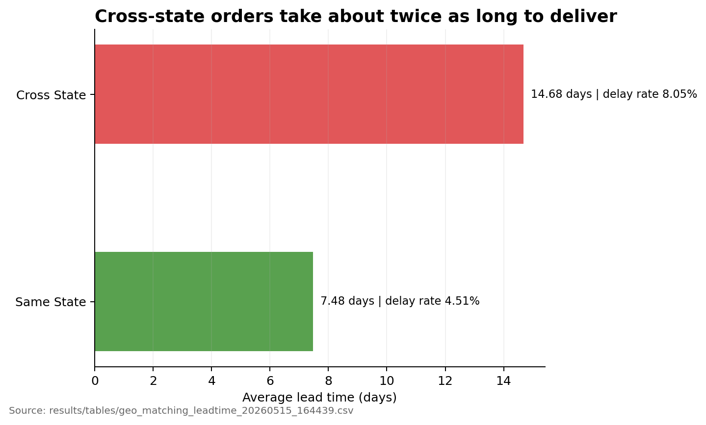
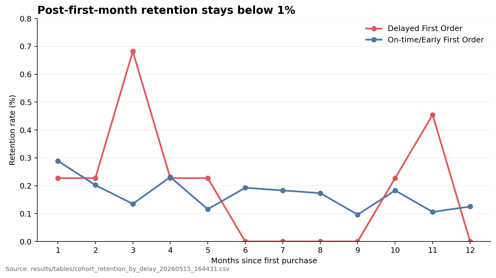
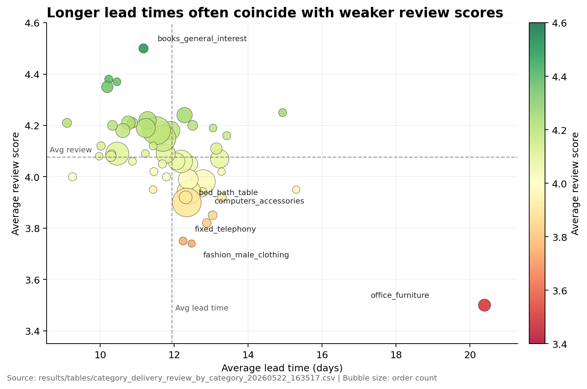

# Olist E-commerce Data Analysis Portfolio

브라질 Olist 이커머스 데이터를 기반으로, 마켓플레이스 운영 병목과 고객 경험/리텐션에 영향을 주는 요인을 분석하는 프로젝트입니다.

## Project Goal

1. 주문-배송 퍼널 병목 구간 진단
2. 배송 성과와 고객 만족도(리뷰 점수) 관계 분석
3. 코호트 리텐션/공급-수요 매칭으로 확장 가능한 분석 자산 구축

## Repository Structure

```text
olist-data-project/
├── sql/
│   ├── staging/      # 정제/표준화 쿼리
│   ├── marts/        # 분석용 마트 생성 쿼리
│   └── analysis/     # 비즈니스 질문별 분석 쿼리
├── results/
│   ├── tables/       # BigQuery 결과 CSV
│   └── figures/      # 차트/이미지 결과물
├── python_scripts/   # 실행/자동화 스크립트
├── dashboard/        # Streamlit 대시보드 (app.py, data.py)
├── .streamlit/       # 테마 + secrets 템플릿
├── requirements.txt  # 대시보드 실행/배포 의존성
└── docs/             # Obsidian 문서 링크
```

## Current Progress

**SQL 분석 자산 → BigQuery 결과 → 시각화 → 인터랙티브 대시보드**까지 완료된 상태입니다.

완료:

- BigQuery 원천 데이터 적재 및 기초 정제
- 상품 카테고리 영문화 view 생성
- 주문/주문상품/배송피처/고객코호트 mart SQL 작성
- 배송 지연, 지역 매칭, 코호트 리텐션, 카테고리별 배송/리뷰 분석 CSV 생성
- 대표 분석 차트 4개 생성
- Obsidian 분석 노트 구조화
- **Streamlit + BigQuery 인터랙티브 대시보드 구축** (KPI 카드 + 4개 분석 탭 + 인사이트)

핵심 SQL 파일:

- `sql/staging/fix_translation_header.sql`
- `sql/staging/create_view_products_english.sql`
- `sql/marts/create_mart_orders.sql`
- `sql/marts/create_mart_order_items.sql`
- `sql/marts/create_mart_delivery_features.sql`
- `sql/marts/create_mart_customer_cohort_monthly.sql`
- `sql/analysis/delay_threshold_analysis.sql`
- `sql/analysis/geo_matching_leadtime_analysis.sql`
- `sql/analysis/cohort_retention_by_delay_experience.sql`
- `sql/analysis/category_delivery_review_by_category.sql`

## Key Findings

### 1. Review scores drop sharply after 3+ days of delay



정시/조기 배송 주문의 평균 리뷰 점수는 **4.28**입니다. 1~2일 지연 시 **3.50**으로 하락하고, 3~4일 지연부터는 **2.58**까지 급락합니다. 낮은 리뷰 비율도 3~4일 지연 구간에서 **53.52%**까지 상승합니다.

### 2. Cross-state orders take about twice as long to deliver



동일 주 배송의 평균 리드타임은 **7.48일**, 타 주 배송은 **14.68일**입니다. 지역 매칭은 배송 성과를 설명하는 핵심 변수로 볼 수 있습니다.

### 3. Post-first-month retention stays below 1%



첫 구매 이후 월별 리텐션은 전반적으로 매우 낮습니다. 첫 주문 지연 경험별 비교는 가능하지만, 코호트별 retained customer 수가 작기 때문에 표본 안정성 검토가 필요합니다.

### 4. Office furniture is the weakest category in delivery experience



`office_furniture`는 평균 리드타임이 **20.39일**로 가장 길고, 평균 리뷰 점수도 **3.50**으로 가장 낮습니다. 예상 배송일 대비 평균 지연이 음수여도, 고객이 체감하는 총 대기 시간이 길면 만족도에 부정적 영향을 줄 수 있습니다.

## BigQuery + Local Workflow

원칙:

- BigQuery: 실행 환경(`raw -> staging -> mart -> analytics`)
- Local Repo: 재현 가능한 분석 자산(SQL, 결과 CSV, 문서, 차트)

권장 루프:

1. BigQuery에서 SQL 실행/검증
2. 확정 쿼리를 `sql/...`에 저장
3. 결과를 `results/tables/*.csv`로 저장
4. 차트 생성 후 `results/figures` 반영
5. README/docs에 인사이트 업데이트

## Quick Start (CLI)

사전 준비:

1. Google Cloud SDK 설치
2. 인증

```bash
gcloud auth application-default login
gcloud config set project <YOUR_GCP_PROJECT_ID>
```

3. `bq` 명령 확인

```bash
bq version
```

## Auto Export Script

아래 스크립트로 SQL 파일을 실행하고 결과를 바로 CSV로 저장할 수 있습니다.

```bash
bash python_scripts/run_bq_query_to_csv.sh \
  sql/analysis/category_delivery_review_by_category.sql \
  category_delivery_review_by_category
```

결과 예시:

- `results/tables/category_delivery_review_by_category_YYYYMMDD_HHMMSS.csv`

## Generate Figures

아래 스크립트로 `results/tables`의 CSV를 읽어 `results/figures`에 PNG 차트를 생성합니다.

```bash
python3 python_scripts/create_analysis_figures.py
```

## Interactive Dashboard (Streamlit + BigQuery)

`dashboard/app.py`는 KPI 카드와 4개 분석 탭(배송 지연 / 지역 매칭 / 카테고리 / 리텐션),
인사이트 섹션으로 구성된 인터랙티브 대시보드입니다.

데이터 소스:

- **기본: BigQuery** — `dashboard/data.py`가 `sql/analysis/*.sql`을 그대로 실행합니다
  (분석 파이프라인과 단일 소스 공유).
- **폴백: CSV** — 자격증명이 없으면 `results/tables`의 커밋된 CSV로 자동 전환되어,
  인증 없이도 대시보드를 띄울 수 있습니다.

### 로컬 실행

```bash
python3 -m venv .venv && source .venv/bin/activate
pip install -r requirements.txt

# BigQuery 라이브 조회용 인증 (없으면 CSV 폴백)
gcloud auth application-default login

streamlit run dashboard/app.py
```

기본 프로젝트는 `olist-analysis-project-495210`이며, `.streamlit/secrets.toml`로 덮어쓸 수
있습니다 (`.streamlit/secrets.toml.example` 참고).

### 배포 (Streamlit Community Cloud)

1. 이 레포를 연결하고 main file을 `dashboard/app.py`로 지정합니다.
2. 앱 Settings → Secrets에 서비스 계정 키(`[gcp_service_account]`)를 붙여넣습니다
   (BigQuery Data Viewer + Job User 권한). 생략하면 CSV 폴백으로 동작합니다.

## Roadmap (Analysis -> ML)

### Phase 1. SQL Analytics Completion

1. 배송 지연 구간별 만족도 하락 임계점 분석
2. 카테고리/지역별 리드타임 편차 분석
3. 코호트 리텐션(재구매율) 분석 연결

### Phase 2. ML-ready Dataset

1. 예측 타깃 정의: `is_delayed`(지연 여부) 또는 `delay_days`(지연 일수)
2. 피처 엔지니어링:
   - 주문 시점 정보(월/요일/시간대)
   - 상품 카테고리/규격(무게, 부피)
   - 판매자/고객 지역 정보
   - 결제 방식, 배송비, 주문 금액
3. 학습용 스냅샷 테이블 생성(`mart_delivery_ml_base`)

### Phase 3. Predictive Modeling

1. 기준 모델(Baseline): Logistic Regression / Random Forest
2. 성능 지표:
   - 분류(`is_delayed`): ROC-AUC, F1, Precision/Recall
   - 회귀(`delay_days`): MAE, RMSE
3. 해석:
   - Feature Importance/SHAP로 지연 기여 요인 도출

### Phase 4. Operationalization

1. 예측 결과를 BigQuery 테이블로 적재
2. `results/tables`, `results/figures` 자동 갱신
3. 대시보드에서 "지연 위험 주문" 모니터링
